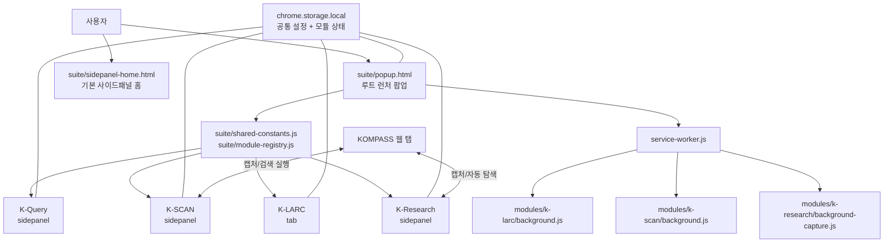
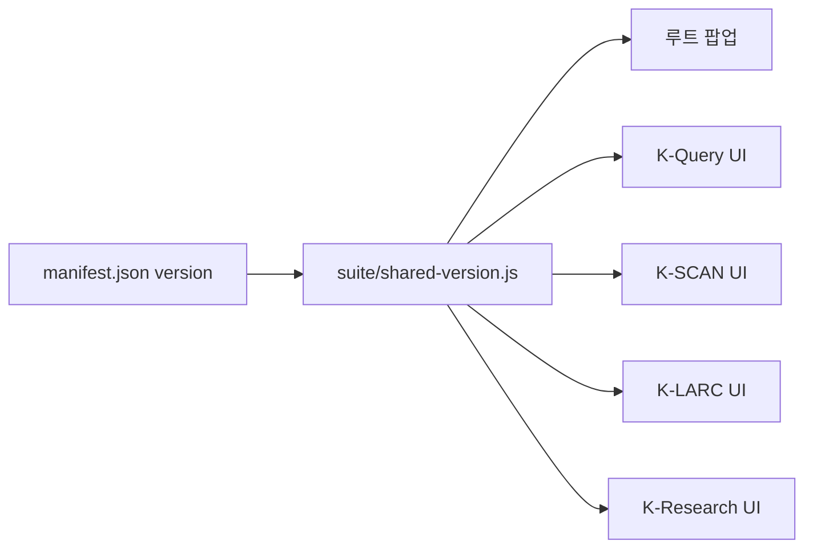
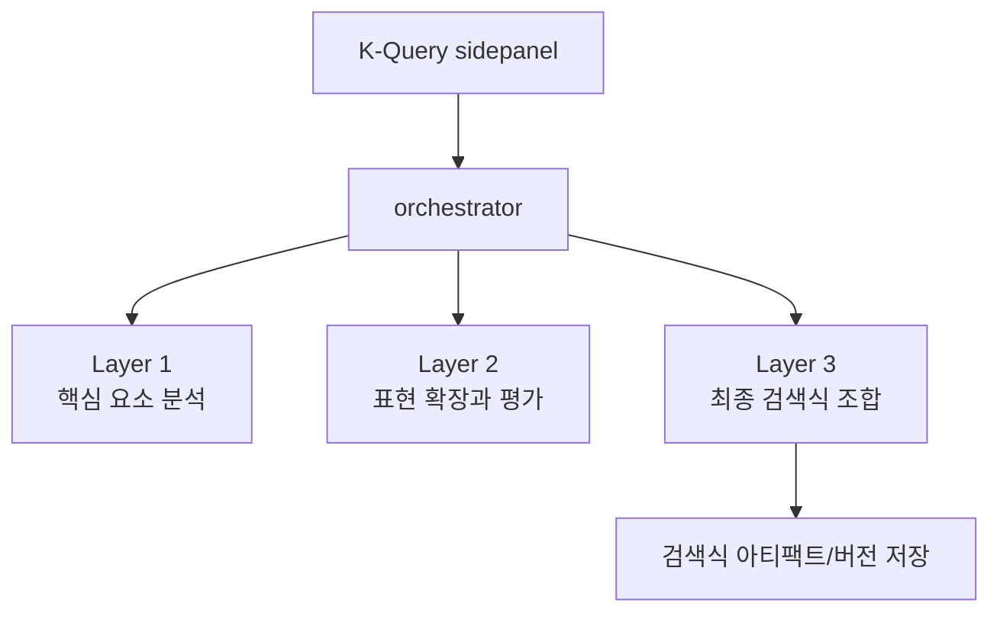
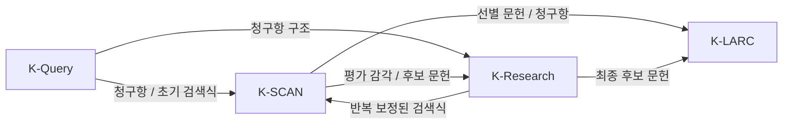
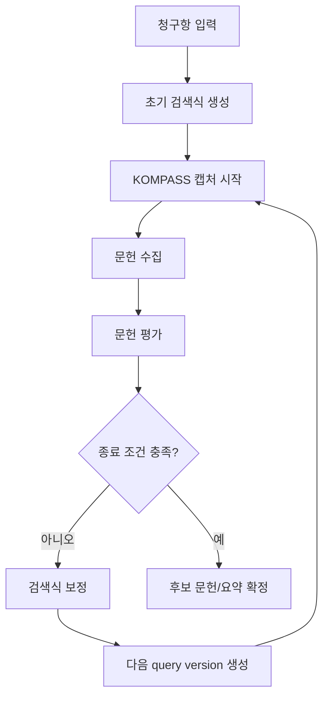

# K-SUITE 아키텍처

이 문서는 현재 저장소 기준으로 K-SUITE가 어떻게 구성되어 있는지 설명합니다. 특히 루트 확장 런처, 공통 설정 계층, 각 모듈의 실행 방식, KOMPASS 캡처 계층, K-Research 자동 탐색 루프, 테스트 계층을 중심으로 정리합니다.

## 1) 아키텍처 개요

K-SUITE는 "여러 독립 확장"의 모음이 아니라, 저장소 루트의 `manifest.json`을 기준으로 동작하는 하나의 Chrome MV3 확장입니다. 이 루트 확장이 다음 역할을 공통으로 담당합니다.

- 모듈 런처 제공
- 공통 설정 저장
- 공통 버전 주입
- 공통 서비스 워커에서 백그라운드 기능 통합
- 사이드패널/탭 열기 정책 관리

그 위에서 실제 기능은 네 개의 모듈이 분담합니다.

- `K-LARC`: 정밀 인용 분석과 의견제출통지서 작업
- `K-Query`: 청구항 기반 검색식 생성과 보정
- `K-SCAN`: KOMPASS 결과 캡처와 유사도 평가
- `K-Research`: 자동 반복 탐색과 검색식 보정

## 2) 런타임 토폴로지

핵심은 다음과 같습니다.

- 진입점은 루트 팝업입니다.
- 모듈 등록 정보와 공통 설정 필드는 `suite/shared-constants.js`와 `suite/module-registry.js`에 집중되어 있습니다.
- 루트 서비스 워커는 모듈별 백그라운드 스크립트를 함께 로드해 공통 오케스트레이션 계층으로 동작합니다.
- 모든 모듈은 `chrome.storage.local`을 중심으로 공통 설정과 일부 상태를 공유합니다.

## 3) 루트 확장 계층

### 3.1 팝업 런처

루트 팝업은 `suite/popup.html` + `suite/popup.js`로 구성됩니다. 이 계층의 책임은 다음과 같습니다.

- 공통 설정 입력과 저장
- 저장된 설정의 유효성 검사
- 활성 탭 문맥에 따라 모듈 실행 가능 여부 판단
- 탭형 모듈과 사이드패널형 모듈의 실행 분기
- 실패 사유를 사용자에게 명확히 피드백

팝업은 모듈 자체 기능을 수행하지 않고, 어디에서 어떤 모듈을 안전하게 열 수 있는지 판단하는 오케스트레이터에 가깝습니다.

### 3.2 공통 모듈 레지스트리

현재 모듈 정의는 공통 레지스트리에서 관리됩니다.

- `K-LARC`: 탭
- `K-Query`: 사이드패널
- `K-SCAN`: 사이드패널
- `K-Research`: 사이드패널

이 설계 덕분에 팝업, 서비스 워커, 네비게이션 UI가 같은 모듈 정의를 공유합니다.

### 3.3 서비스 워커

루트 `service-worker.js`는 다음 역할을 수행합니다.

- 공통 설정 초기화
- 예전 API 키 저장 형식 마이그레이션
- 모듈 실행 메시지 처리
- 사이드패널 열기와 탭 열기 정책 집행
- K-SCAN 캡처 제어 메시지 처리

현재 서비스 워커는 모듈별 백그라운드 코드를 직접 가져와 통합된 백그라운드 런타임을 형성합니다.

## 4) 실행 규칙과 컨텍스트 제약

모듈은 아무 탭에서나 열리지 않습니다. 현재 코드 기준 제약은 다음과 같습니다.

- `K-LARC`
  - 확장 내부 탭 화면으로 열립니다.
  - 기존 탭이 있으면 포커스하고, 없으면 새 탭을 엽니다.
- `K-Query`
  - 사이드패널로 열립니다.
  - `chrome://extensions`, `edge://extensions` 같은 설정 탭에서는 열 수 없습니다.
- `K-SCAN`
  - 사이드패널로 열립니다.
  - `http/https` 웹 탭이 필요합니다.
  - `K-LARC` 대시보드 탭에서는 열 수 없습니다.
- `K-Research`
  - 사이드패널로 열립니다.
  - `http/https` 웹 탭이 필요합니다.
  - 실사용 기준으로 KOMPASS 탭 문맥이 전제됩니다.

사이드패널을 열 수 있는 적절한 탭이 없을 경우, 루트 서비스 워커와 네비게이션 계층은 fallback 탭 정책을 사용합니다.

## 5) 공통 설정과 공유 상태

### 5.1 공통 설정

모든 모듈은 아래 두 설정을 공유합니다.

- `OpenWebUI Base URL`
- `Shared API Key / Token`

이 설정은 루트 팝업에서 저장되며, 모듈마다 따로 입력받지 않습니다.

### 5.2 저장소 구조

저장소는 `chrome.storage.local`을 중심으로 운영됩니다. 현재 구조는 크게 세 층으로 나뉩니다.

- 공통 설정 계층
  - OpenWebUI 주소
  - 공유 API 키
- 모듈 간 공유 계층
  - 청구항 공유
  - 일부 검색식/평가 결과 공유
- 모듈별 상태 계층
  - K-Query 검색식 아티팩트
  - K-SCAN 평가 이력과 큐 상태
  - K-LARC 분석 결과와 작업공간 상태
  - K-Research 세션, 반복, 캡처 이력

설계 원칙은 "루트 설정은 공통, 세부 상태는 모듈별 namespace 분리"입니다.

### 5.3 하위 호환

서비스 워커와 팝업은 예전 키 이름을 현재 공유 키로 옮기는 마이그레이션 로직을 가지고 있습니다. 즉, 설정 계층은 단일화됐지만 기존 로컬 데이터와도 최대한 호환되도록 설계되어 있습니다.

## 6) 버전과 공통 UI 자산

현재 버전 표시는 `manifest.json`을 단일 소스로 사용합니다. `suite/shared-version.js`가 이를 각 화면에 주입합니다.

또한 각 모듈 UI는 공통 자산을 함께 사용합니다.

- `suite/shared-constants.js`
- `suite/shared-version.js`
- `suite/shared-feedback.js`
- `suite/unified-theme.css`

이 계층 덕분에 각 모듈이 독립 화면이면서도 K-SUITE 안에서 일관된 제품처럼 동작합니다.

## 7) 모듈별 런타임 구조

## 7.1 K-Query

K-Query는 검색식 생성 파이프라인을 담당합니다.

주요 책임:

- 청구항 입력
- 핵심 요소 추출
- 표현 확장과 필터링
- 최종 검색식 조합
- 검색식 결과와 이력 저장

내부 구조는 다음과 같이 요약할 수 있습니다.

이 모듈은 K-SUITE 전체 흐름에서 "검색 전략의 출발점" 역할을 합니다.

## 7.2 K-SCAN

K-SCAN은 KOMPASS 기반 캡처와 문헌 평가를 담당합니다.

주요 책임:

- KOMPASS 응답 캡처
- 출원발명/청구항과 문헌 비교
- 점수와 설명 생성
- 결과 창 제공
- 선택 항목 재평가

런타임은 크게 두 부분으로 나뉩니다.

- 사이드패널
  - 캡처 시작/중지
  - 청구항 입력 또는 K-Query 가져오기
  - 템플릿 관리
- 백그라운드 + 결과 창
  - 네트워크 캡처
  - DWPI와 본문 짝맞춤
  - 평가 큐 처리
  - 결과 이력 렌더링

## 7.3 K-LARC

K-LARC는 가장 깊은 정밀 분석 작업공간입니다.

주요 책임:

- 청구항 구성요소 분석
- 인용문헌 대응 관계 정리
- 근거 검토
- 의견제출통지서용 정리
- 문헌 Q&A
- 디버그와 검증 추적

K-LARC는 탭형 대시보드로 열리며, 여러 작업면을 한 화면에 묶는 구조입니다.

- 분석 결과 작업면
- 의견제출통지서 작업면
- 문헌 Q&A 작업면
- 디버그 작업면

아키텍처 관점에서 K-LARC는 "후보 문헌을 확정한 뒤 들어가는 마지막 정밀 분석 계층"입니다.

## 7.4 K-Research

K-Research는 자동 탐색 루프를 담당합니다.

주요 책임:

- 청구항 기반 초기 검색식 생성
- KOMPASS 캡처 실행
- 문헌 평가와 점수 집계
- too many / too few / balanced 판단
- 검색식 재조정
- 종료 조건 판정

현재 UI는 자동 우선 구조입니다.

- `실행`
- `결과`
- `고급`

즉, K-Research는 단순히 "검색식을 한 번 만드는 도구"가 아니라, 반복 탐색을 운영하는 관제판입니다.

## 8) 모듈 간 데이터 흐름

현재 프로젝트 기준 권장 흐름은 다음과 같습니다.

1. K-Query에서 초기 검색식 생성
2. K-SCAN에서 실제 검색 결과 평가
3. 필요 시 K-Research에서 자동 반복 탐색
4. 최종 후보를 K-LARC에서 정밀 분석

즉, K-SUITE는 선형 파이프라인이라기보다 "탐색과 분석을 왕복하는 구조"에 가깝습니다.

## 9) KOMPASS 캡처 계층

현재 저장소에서 가장 중요한 백그라운드 계층 중 하나는 KOMPASS 캡처 계층입니다.

## 9.1 K-SCAN 캡처

K-SCAN 백그라운드는 Chrome debugger와 네트워크 이벤트를 이용해 다음 흐름을 처리합니다.

- 검색 결과 요청 감지
- 본문 응답과 DWPI 응답 수집
- 짝맞춤
- 텍스트 정리
- 평가 큐 적재
- 결과 창 저장

이 계층은 단순한 화면 자동화가 아니라 "캡처 -> 정규화 -> 평가 -> 이력화" 파이프라인입니다.

## 9.2 K-Research 캡처

K-Research는 별도의 `background-capture.js` 계층으로 capture-only 경로를 운영합니다.

이 계층의 특징:

- 루트 탭과 파생 탭 구분
- 자동 attach와 수동 attach 구분
- 캡처 범위 관리
- 진단 정보 누적
- 저장된 행의 우선순위 구분

즉, K-Research는 단순 캡처보다 "자동 탐색 루프에 맞춘 캡처 인프라"를 별도로 가진 구조입니다.

## 9.3 선택적 보조 확장

저장소의 `KOMPASS Control/`은 루트 K-SUITE 확장과 별개인 보조 확장입니다. 현재 주 런타임의 필수 요소는 아니지만, KOMPASS 상호작용 보조 도구로 함께 사용될 수 있습니다.

## 10) K-Research 자동 탐색 루프

현재 코드 기준 루프의 핵심 성격은 다음과 같습니다.

- 세션 기반으로 반복을 누적 관리
- 검색식 버전을 반복마다 따로 기록
- 결과 수와 품질 신호를 함께 사용
- 너무 많음 / 너무 적음 / 적정 경로를 별도로 처리
- 단일 후보뿐 아니라 조합 후보까지 고려

또한 UI는 자동 루프를 직접 설명하는 상태 카드 중심으로 구성되어, 사용자가 "지금 무엇이 일어나고 있는지"를 즉시 파악할 수 있게 설계되어 있습니다.

## 11) 문서와 테스트 계층

현재 저장소는 빌드 도구 중심 구조보다 문서 + 직접 실행 + Node 테스트 중심 구조에 가깝습니다.

### 11.1 문서 계층

- `README.md`: 진입과 실행 가이드
- `ARCHITECTURE.md`: 구조와 런타임 설명
- `docs/`: 시스템/모듈 설명
- `updates/`: 날짜별 변경 메모

### 11.2 테스트 계층

현재 확인 가능한 테스트 축은 다음과 같습니다.

- 스모크 체크
  - 공통 레지스트리
  - 런처 생성
  - 공통 스크립트 로드
  - 인코딩 규칙
- K-Research 회귀 테스트
  - 세션 마이그레이션
  - planner 동작
  - 쿼리 리매핑
  - pair termination
  - 프롬프트 계약 검증
- K-LARC XML 추출 테스트
  - 스크립트 아티팩트 제거
  - 렌더링 fallback
  - raw fallback

즉, 테스트는 전체 제품을 한 번에 E2E 자동화하기보다, 중요한 공통 계약과 핵심 알고리즘을 보호하는 방향으로 배치되어 있습니다.

## 12) 현재 아키텍처의 핵심 포인트

- 루트 확장이 모든 모듈의 실행과 공통 설정을 관리한다.
- 탭형과 사이드패널형 모듈이 같은 레지스트리를 공유한다.
- 백그라운드 계층은 루트 서비스 워커에서 통합된다.
- `chrome.storage.local`이 공통 설정과 모듈 간 연결의 중심이다.
- K-SCAN과 K-Research는 KOMPASS 캡처를 공유 주제로 가지지만, 목적이 다른 별도 경로를 가진다.
- K-LARC는 최종 정밀 분석 작업공간이다.
- K-Research는 자동 반복 탐색 관제판으로 특화되어 있다.
- 테스트는 공통 계약과 핵심 파이프라인 안정성에 집중되어 있다.
