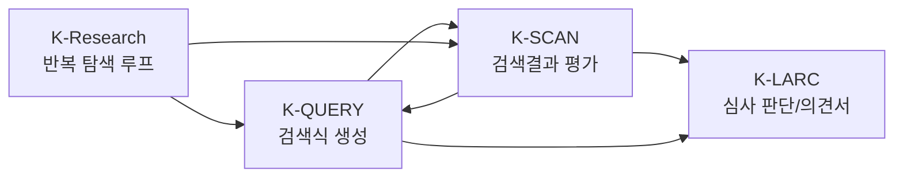
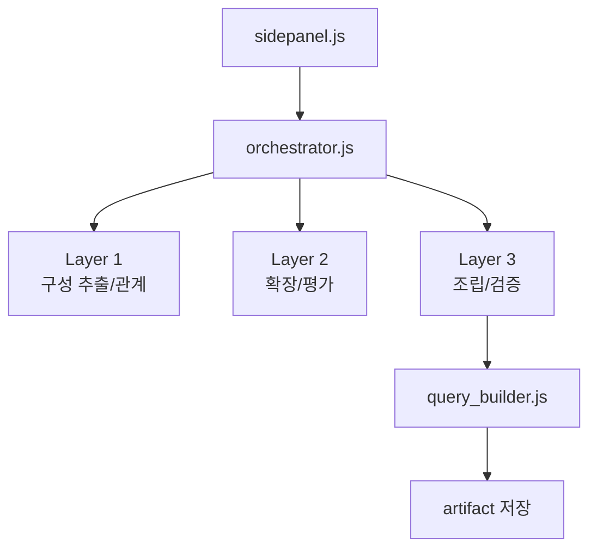
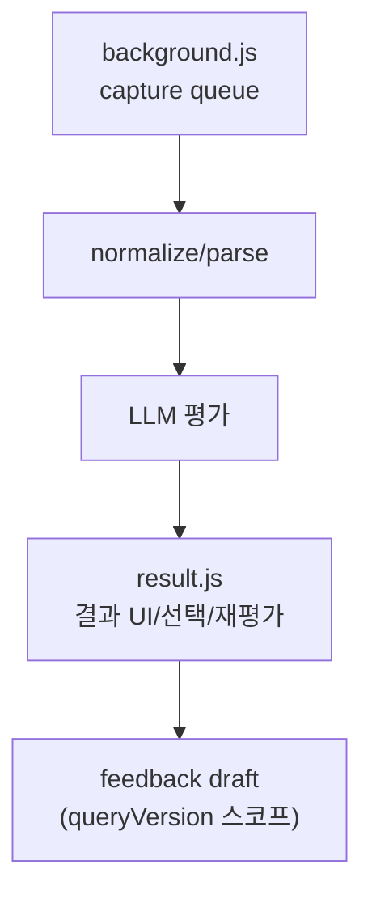
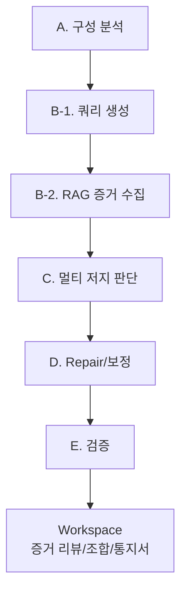
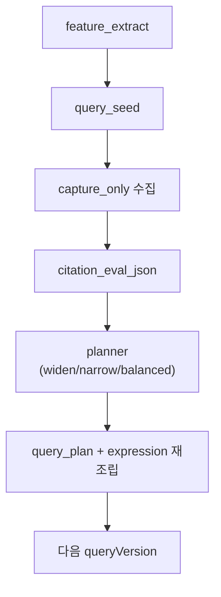

# K-SUITE 모듈 상세 가이드

이 문서는 `K-QUERY`, `K-SCAN`, `K-LARC`, `K-Research`를 각각 분리해서 설명합니다.  
각 모듈의 입력/출력, 핵심 기능, 아키텍처, 설계 배경(이유/고민)을 함께 정리합니다.

## 1. 모듈 맵

## 2. K-QUERY

### 2.1 역할

- 청구항을 검색 가능한 구성으로 분해
- 핵심 구성 중심 검색식 생성
- 피드백 반영(폭 조절/동의어 조정/버전 이력)

### 2.2 입력/출력

| 구분 | 내용 |
|---|---|
| 입력 | 청구항 텍스트, 사용자 breadth 설정, K-SCAN 피드백 |
| 출력 | 최종 검색식(expression), query artifact, query versions |

### 2.3 내부 아키텍처

### 2.4 설계 배경

- 고민: LLM이 길고 과한 용어를 자주 생성해서 검색성이 떨어짐
- 대응:
  - 구조 추출과 최종 조립을 분리
  - preview와 최종식을 같은 렌더 규칙으로 통일
  - 버전별 아티팩트를 저장해 되돌리기/비교 가능하게 설계

## 3. K-SCAN

### 3.1 역할

- KOMPASS 네트워크 수집(bpService/do, getDWPIAbst/do)
- 청구항 대비 문헌 유사도 평가
- 선택 문헌 재평가/출원번호 일괄 추출/피드백 초안 생성

### 3.2 입력/출력

| 구분 | 내용 |
|---|---|
| 입력 | 출원발명 청구항, 캡처된 문헌 텍스트 |
| 출력 | 점수/이유/근거 테이블, 선택 문헌 목록, K-QUERY 피드백 draft |

### 3.3 내부 아키텍처

### 3.4 설계 배경

- 고민: 대량 결과 처리에서 버전 혼입과 중복평가 문제가 발생
- 대응:
  - `queryVersionId` 기준 스코프 강제
  - 재평가 dedupe 키를 `queryVersionId + applicationNo` 중심으로 분리
  - 결과 내용을 마크다운 렌더링해 실무 가독성 개선

## 4. K-LARC

### 4.1 역할

- 인용발명 증거를 구조적으로 판정(A/B/C/D/E)
- 증거 리뷰/인용발명 조합 선택/의견제출통지서 작성
- 심사 의사결정 워크스페이스 제공

### 4.2 입력/출력

| 구분 | 내용 |
|---|---|
| 입력 | 청구항, 인용발명 D1..Dn, 단계별 프롬프트 설정 |
| 출력 | 구성별 evidence/relevant, 증거 리뷰 결과, 의견제출통지서 표/문안 |

### 4.3 내부 아키텍처

### 4.4 설계 배경

- 고민 1: 자동 판정 결과가 항상 신뢰 가능하지 않음
  - 대응: 워크스페이스 레이어에서 `채택/보류/제외` 수동 결정을 허용
- 고민 2: 주/부 인용발명 선택 근거가 불명확함
  - 대응: 추천 점수 + 누락구성별 보완 문헌 선택 UI 분리
- 고민 3: 의견서 생성이 증거 선택과 분리됨
  - 대응: 선택된 primary/support evidence를 통지서 표/문안에 직접 바인딩

## 5. K-Research

### 5.1 역할

- 하네스 기반 반복 탐색 루프 자동화
- 검색식 생성 -> 수집 -> 평가 -> 보정 반복
- 단일 고점수 또는 2문헌 조합 커버리지 충족 시 종료

### 5.2 입력/출력

| 구분 | 내용 |
|---|---|
| 입력 | 청구항, 캡처 row, 수동 게이트(결과 많음/적음/적정) |
| 출력 | query versions, iteration summary, 종료 판정(single/pair), 피드백 이력 |

### 5.3 내부 아키텍처

### 5.4 설계 배경

- 고민 1: 초기 검색식이 과도하게 구체적이라 결과가 0건으로 자주 떨어짐
  - 대응: 원자 키워드 중심, 핵심 2~3 그룹으로 시작
- 고민 2: too_few/too_many 조정이 실효성이 낮음
  - 대응: 수동/자동 경로를 같은 planner 정책으로 통합
- 고민 3: 파생 탭 수집 누락 원인 파악이 어려움
  - 대응: attach vs discard 진단 분리, diagnostics 상태 노출

## 6. 모듈 간 기능 연결 포인트

### 6.1 청구항 공유

- K-QUERY -> K-SCAN
- K-SCAN -> K-LARC
- 필요 시 K-Research 세션 입력으로 재사용

### 6.2 피드백 공유

- K-SCAN 결과 기반 피드백을 K-QUERY/K-Research 보정에 활용
- K-LARC 증거 판단은 의견서 생성과 직접 연결

### 6.3 공통 설정

- `OpenWebUI Base URL`
- `Shared API Key / Token`
- `manifest` 기반 공통 버전 배지

## 7. 확장 시 권장 기준

- 모듈 간 계약(`queryVersionId`, `runId`, storage key)을 먼저 고정하고 기능 추가
- LLM 프롬프트 변경 시, 코드 정규화/검증 경로를 반드시 함께 업데이트
- UI 기능 추가는 분석 엔진 자체를 바꾸기보다 워크스페이스 레이어에 우선 배치

