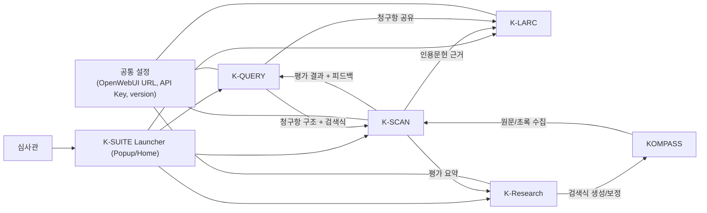
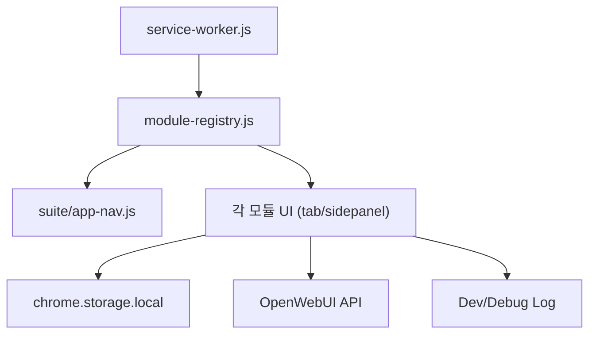

# K-SUITE 시스템 가이드

이 문서는 현재 `K-SUITE`를 구성하는 전체 시스템의 목적, 설계 배경, 아키텍처 선택 이유를 설명합니다.

## 1. 왜 K-SUITE가 필요한가

특허 심사 실무에서는 다음 문제가 반복됩니다.

- 청구항을 검색식으로 변환할 때 품질 편차가 큼
- 검색 결과가 많거나 적을 때 조정 근거가 약함
- 인용발명 검토, 증거 판정, 의견서 작성이 분절되어 재작업이 많음
- 도구 간 데이터 전달이 끊겨 판단 이력이 누락됨

K-SUITE는 이 문제를 `생성(K-QUERY) -> 평가(K-SCAN) -> 판단(K-LARC) -> 반복 탐색(K-Research)`로 연결해 해결하도록 설계되었습니다.

## 2. 설계 원칙

- 실무 중심: 한 번에 완벽한 정답보다, 반복 가능한 개선 루프를 우선
- 혼합형 엔진: LLM 자유 생성 + 규칙 기반 조립/검증 결합
- 모듈 분리: 검색식 생성/검색결과 평가/거절이유 분석을 역할별로 분리
- 로컬 우선: `chrome.storage.local` 기반으로 세션/이력/버전 저장
- 디버그 가능성: 입력, 출력, 판정 근거를 최대한 구조화해 남김

## 3. 전체 아키텍처

## 4. 아키텍처 배경과 고민

### 4.1 모듈 분리 아키텍처를 택한 이유

- 검색식 생성 품질 문제와 인용발명 판단 문제는 실패 패턴이 다릅니다.
- 하나의 거대한 파이프라인으로 묶으면 수정 범위가 커지고 디버깅이 어려워집니다.
- 그래서 `K-QUERY/K-SCAN/K-LARC/K-Research`를 느슨하게 결합하고, 데이터 계약으로 연결했습니다.

### 4.2 LLM + 규칙 기반 하이브리드의 이유

- LLM만 사용하면 출력 형식이 흔들리고 재현성이 낮아집니다.
- 규칙만 사용하면 도메인 표현 변형(동의어/표현차)을 따라가기 어렵습니다.
- 따라서 LLM은 `구조화 JSON 생성`, 코드는 `검증/정규화/최종 조립`을 담당하도록 분리했습니다.

### 4.3 로컬 스토리지 중심 설계 이유

- 사내/폐쇄망 환경에서도 동작해야 하므로 서버 의존도를 줄였습니다.
- 모듈 간 전달을 빠르게 하기 위해 공통 키(`ksuiteClaim*`, `KQUERY_*`, `KSCAN_*`, `KLARC_*`, `KRESEARCH_*`)를 사용합니다.
- 단점(키 충돌, 구버전 스키마 혼재)은 `normalize/migration` 로직으로 완화합니다.

### 4.4 버전/실행 단위 분리 이유

- 같은 출원번호라도 검색식 버전이 다르면 의미가 달라집니다.
- 그래서 `runId`, `queryVersionId`를 분리해 혼입을 방지합니다.
- 이 구조가 K-SCAN 재평가/피드백, K-Research 반복 루프의 안정성을 만듭니다.

## 5. 실행 아키텍처 (Chrome MV3)

- K-LARC: 탭(tab) 중심 대시보드
- K-QUERY/K-SCAN/K-Research: 사이드패널(sidepanel) 중심

## 6. 공통 데이터 계약

- 공통 설정
  - `webuiBaseUrl`
  - `ksuiteSharedApiKey`
- 청구항 공유
  - `ksuiteClaimKQuery`
  - `ksuiteClaimKScan`
- 모듈별 상태
  - `KQUERY_*`, `KSCAN_*`, `KLARC_*`, `KRESEARCH_*`

## 7. End-to-End 대표 시나리오

### 시나리오 A: 검색식 개선 루프

1. K-QUERY에서 초기 검색식 생성
2. K-SCAN에서 결과 캡처/유사도 평가
3. K-QUERY 피드백 반영으로 검색식 재생성
4. 필요 시 K-Research에서 자동 반복 루프 실행

### 시나리오 B: 거절이유 분석/의견서 작성

1. K-SCAN 결과를 바탕으로 인용문헌 선별
2. K-LARC A/B/C/D/E 분석 수행
3. 증거 리뷰/인용발명 조합 선택
4. 의견제출통지서 테이블 + 문안 생성

## 8. 현재 구조의 트레이드오프

- 장점
  - 모듈별 독립 개선 가능
  - 디버그/로그 추적이 쉬움
  - 실무 루프에 맞는 반복형 워크플로 제공
- 단점
  - 저장 키/세션 관리가 복잡
  - 모듈 간 UX 일관성 유지 비용 증가
  - LLM 품질 편차를 지속적으로 보정해야 함

