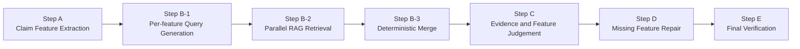
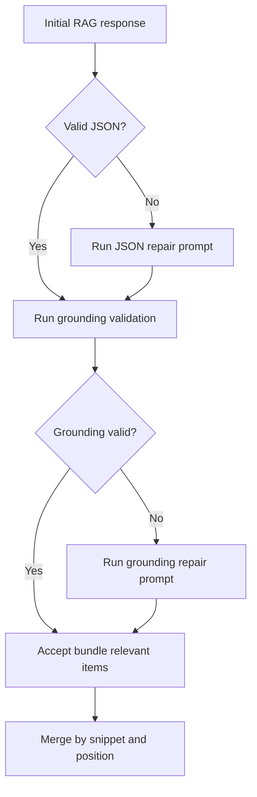
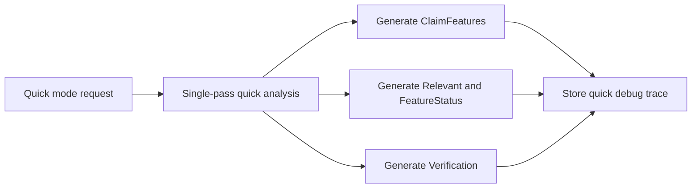

# K-LARC 5 레이어 판정 시스템 (구현 상세, 최신 버전)

## 0. 문서 목적
- 이 문서는 K-LARC `Deep Analysis` 파이프라인(A~E)의 실제 구현을 운영/디버깅 관점에서 정리한다.
- 핵심 목표는 다음 4가지다.
1. Step 단일 책임(Single Responsibility) 유지
2. Grounding 우선(근거 없는 출력 차단)
3. 결정론 병합으로 결과 변동성 축소
4. LLM 입출력 trace를 통한 재현 가능한 디버깅

기준 코드:
- `modules/k-larc/scripts/analysis.js`
- `modules/k-larc/scripts/utils.js`
- `modules/k-larc/scripts/data.js`
- `modules/k-larc/scripts/ui.js`
- `modules/k-larc/prompts/*`

## 1. 아키텍처 개요

### 1.1 Deep 파이프라인
1. Step A: 청구항 구성요소 분해
2. Step B-1: Feature별 멀티 쿼리 생성
3. Step B-2: 쿼리 번들 병렬 RAG + Repair 루프(JSON/grounding)
4. Step B-3: 결정론 병합(LLM 미사용)
5. Step C: Evidence 단위 판정 + Feature 상태 판정
6. Step D: 누락 Feature 재탐색 + C 재판정
7. Step E: 최종 검증(caution/warning)

### 1.2 Quick 파이프라인
- `step_quick_analysis` 한 번으로 `ClaimFeatures/Relevant/FeatureStatus/Verification`을 생성한다.
- 타이밍/진행 상태는 A만 실행, B~E는 `skipped` 처리한다.

## 2. 전역 계약(데이터/식별자/명명)

### 2.1 식별자 규칙
- Claim ID: 앱 내부 claim id 사용
- Feature ID: `F1`, `F2`, ...
- Citation Doc Name: `D1`, `D2`, ... 로 통일
- Evidence ID(C 단계 내부): `R0001`, `R0002`, ...

### 2.2 Citation 명명 통일 정책(`D1~Dn`)
- 신규/직접입력/PDF/탭 추가 모두 `buildCitationDocName(index)`를 통해 `D#` 부여
- 저장 데이터 로드시 `normalizeCitationNamesInPlace`로 정규화
- 기존 분석 결과(`Relevant`, `stepBRelevant`, `verifications`)도 `migrateAnalysisResultsCitationNames`로 함께 치환
- 항목 삭제 시에도 재인덱싱 후 분석 결과 키까지 동기화

### 2.3 Relevant 표준 형태
- 파이프라인 내부 표준:
`{ Dn: [ { Feature, MatchType, Content, SourceExcerpt, Position } ] }`
- B/C/D 내부에서는 `SourceExcerpt` 유지
- 최종 표에 쓰는 `target.Relevant` 저장 시 `mergeRelevantBySnippet(..., { dropSourceExcerpt: true })`로 경량화

### 2.4 Grounding 표준
- `Position`은 센티넬 기반 위치를 기본으로 사용
- `validateAndRepairRelevantEntries`가 다음을 수행한다.
1. 항목 구조/필수 필드 검증
2. Position 정규화/자동 보정 가능한 항목 보정
3. 보정 불가 항목은 invalid로 분리

## 3. 공통 LLM 호출/디버그 설계

### 3.1 공통 호출 함수
- 모든 LLM 호출은 `sendLLMRequest(payload, options)`로 통일한다.
- `options`에 `stepKey`, `promptKey`, `label`을 넣어 trace 맥락을 보존한다.

### 3.2 LLM trace(`_llmTrace`) 구조
- 공통 필드:
`traceId`, `requestedAt`, `respondedAt`, `elapsedMs`, `mode(mock/live)`, `stepKey`, `promptKey`, `label`
- 입출력:
`request`, `response`, `responseText`
- trace 폭주 방지:
문자열 길이/배열 길이/객체 키 개수/깊이 제한을 적용한다.

### 3.3 trace 저장 위치
- Step A: `result.debug.stepA.llm`
- Step B-1: `result.debug.stepB.stepB1.llm`
- Step B-2: `result.debug.stepB.responses[*].result.debug.llm`
- Step B-2 Repair: `...repairs[*].llm`
- Step C: `result.debug.stepC.llm`
- Step D: `result.debug.stepD.repair.llm`
- Step E: `result.debug.stepE.llm` + `rawOutput` + `parsed`
- Quick: `result.debug.quick.llm`

## 4. Step별 상세 역할(핵심)

## Step A. 구성요소 분해

### 역할
- 청구항을 검증 가능한 최소 단위 Feature로 분해한다.
- 이 단계는 "분해만" 담당하고 근거 탐색/판정은 하지 않는다.

### 입력 계약
- `claim_id`, `claim_text`
- 프롬프트: `prompts/step_a_features/*`

### 처리
1. `runStepAForClaim`가 프롬프트 렌더링
2. `sendLLMRequest(..., { stepKey: "stepAFeatures" })`
3. JSON 파싱
4. `llm` trace를 결과에 부착

### 출력 계약
- 기본 출력:
`{ ClaimFeatures: [ { Id, Description } ] }`
- 오케스트레이터 반영:
`target.ClaimFeatures` 세팅, 후속 단계 입력으로 전달

### 실패 처리
- Step A 실패 시 해당 claim은 즉시 중단, `stepAError` 기록

## Step B. 멀티쿼리 RAG

Step B는 품질 변동을 줄이기 위해 B-1/B-2/B-3를 명확히 분리한다.

## Step B-1. 쿼리 생성

### 역할
- Feature별 검색 쿼리를 생성한다.
- 탐색 다양성은 여기서만 확보하고, 이후 단계는 안정성 중심으로 동작한다.

### 입력 계약
- `claim_features_json`
- 프롬프트: `prompts/step_b_query/*`
- 프롬프트 규칙상 4개 유형(Direct/Functional/Structural/Variant)

### 처리
1. LLM 결과를 `parsed.Queries`로 수신
2. feature별 쿼리 개수 집계
3. `bundleCount`를 `1~4`로 강제
4. `ensureQueryCount`로 부족분 보완

### 출력 계약
- `queriesByFeature: { F1: [q1..q4], ... }`
- `debug: { parsed, llm }`

## Step B-2. 병렬 RAG + Repair 루프

### 역할
- 쿼리 번들을 병렬 전송해 근거 후보를 수집한다.
- 구조가 깨지거나 grounding이 약한 응답은 즉시 Repair 루프로 보정한다.

### 입력 계약
- 쿼리 번들(`query_index`, `combined_query`, `features_json`)
- `mapInfo`(완료된 문헌의 `D#` 목록)
- 파일 첨부: `files: buildFileRefs(fileIds)`
- 프롬프트: `prompts/step_b_rag/*`

### 처리(번들 단위)
1. 원본 B-2 호출
2. JSON 파싱 실패 시 `step_b_rag_repair`로 `json_repair`
3. 파싱 성공 후 `validateAndRepairRelevantEntries` 수행
4. invalid 항목 존재 시 `grounding_repair` 호출
5. 최종 결과를 `mergeRelevantBySnippet(..., dropSourceExcerpt: false)`로 정규화

### 출력 계약(번들 단위)
- `Relevant`(SourceExcerpt 포함)
- `debug`:
`initialAssistantContent`, `initialParsed`, `initialValidation`, `repairs[]`, `llm`

### 출력 계약(집계)
- `responses[]`(성공/실패 포함)
- `queriesByIndex[]`
- `relevant`(번들 간 병합 결과, SourceExcerpt 유지)

## Step B-3. 결정론 병합

### 역할
- B-2 결과를 최종 병합한다.
- 이 단계는 LLM을 호출하지 않는다(결정론).

### 처리
1. 성공 응답만 추림
2. `mergeRelevantWithPositions`로 합침
3. `mergeRelevantBySnippet(..., dropSourceExcerpt: false)`로 중복 제거/정규화
4. 문헌별 개수 통계 생성

### 출력 계약
- `relevant`: Step C 입력용 병합 근거
- `debug`: `{ mode: "deterministic", responseCount, queryIndexes, docStats }`

## Step C. 멀티 판정

### 역할
- 근거 선택(EvidenceDecision)과 Feature 상태(FeatureStatus)를 동시에 판정한다.
- 판정만 담당하고, 새로운 근거 생성은 하지 않는다.

### 입력 계약
- `claim_features_json`
- `stepb_merged_relevant_json` (EvidenceId 부여된 형태)
- 프롬프트: `prompts/step_c_multijudge/*`

### 처리
1. `buildStepCEvidenceBundle`로 `R0001...` 부여
2. LLM 출력 `FeatureStatus`, `EvidenceDecision` 파싱
3. 누락 EvidenceId는 기본 `F` 처리
4. `P` 근거만 재구성해 `relevant` 생성

### 출력 계약
- `relevant`, `featureStatus`
- `debug`: `FeatureStatus`, `EvidenceDecision`, `legacyRelevantFallback`, `llm`
- 오케스트레이터는 이 결과를 `target.Relevant`, `target.FeatureStatus`로 반영

## Step D. 리페어(누락 Feature 보강)

### 역할
- C 결과에서 누락/부분 충족 Feature만 다시 찾는다.
- "누락 Feature 보강"만 담당하며 전체 재분석은 하지 않는다.

### 입력 계약
- `missing_features_json`
- `current_relevant_json`
- `mapInfo`, 파일 첨부
- 프롬프트: `prompts/step_d_repair/*`

### 처리
1. `getMissingFeatures`로 대상 Feature 선별
2. D 프롬프트 호출로 `Queries + Relevant` 수신
3. `validateAndRepairRelevantEntries`로 로컬 grounding 검증
4. 누락 feature id만 남도록 필터링
5. 후보가 있으면 Step C를 missing set에 한 번 더 실행
6. C가 `P`로 채택한 근거만 최종 `target.Relevant`에 병합

### 출력 계약
- `target.Relevant` 보강
- `target.FeatureStatus` 갱신
- `debug.stepD`:
`repair`(D 응답+검증+llm), `reviewByStepC`, `acceptedRelevant`

### 스킵 규칙
- missing feature가 없으면 Step D는 `skipped`

## Step E. 최종 검증

### 역할
- 최종 `Relevant`의 정확성/위치 일치/과장 가능성을 점검한다.
- 문제 항목만 `verifications`에 기록한다.

### 입력 계약
- `summary_results_json`(claim별 Feature+Relevant 요약)
- `grounded_evidence_json`(로컬 payload 기반 위치 추출 결과)
- `all_claims_text`, `citation_map`
- 프롬프트: `prompts/verification/*`

주의:
- Step E는 별도 파일 첨부 없이, 로컬에서 구성한 `grounded_evidence_json`을 주요 근거로 사용한다.

### 처리
1. `buildVerificationGroundedEvidence`로 Position별 source snippet 구성
2. LLM 검증 호출
3. `CLAIMID_FEATUREID_DOC` 키를 내부 `FEATURE_DOC` 키로 매핑하여 저장
4. claim별 debug에 `stepEInput`, `stepE(llm/rawOutput/parsed)` 기록

### 출력 계약
- `analysisResults[claimId].verifications["F1_D1"] = { status: "caution|warning", reason }`

## 5. 오케스트레이션/상태 관리

### 5.1 진행 상태
- claim마다 A~E 상태를 독립 추적
- 타이밍(`stepTimings`)과 step 상태(`active/done/error/skipped`)를 병행 관리

### 5.2 에러 격리
- 한 claim의 Step 실패가 다른 claim 실행을 중단시키지 않는다.
- 각 단계 에러는 `stepAError/stepBError/...`로 분리 저장한다.

### 5.3 결과 저장
- 각 claim 결과는 `analysisResults[claimId]`에 누적
- 로컬 스토리지와 디버그 패널이 같은 데이터를 공유

## 6. 디버그 패널/내보내기 동작

### 6.1 디버그 패널
- Step A/C/D/Quick: 각 step debug payload 표시
- Step B: 번들별 응답/실패/병합 항목을 분리 표시
- Verification 탭: `verifications` + `stepEInput` + `stepE` 동시 표시

### 6.2 JSON 내보내기
- `buildAnalysisExportPayload`가 claim별 `debug`를 그대로 포함
- 즉, LLM 입출력 trace도 export 파일에서 재현 가능

## 7. Step 책임 재정의 요약

1. A: 분해만 수행
2. B-1: 쿼리 생성만 수행
3. B-2: 근거 추출 + 구조/grounding repair 수행
4. B-3: 결정론 병합만 수행(LLM 없음)
5. C: 판정만 수행(근거 생성 금지)
6. D: 누락 Feature 보강 + C 재판정 연결
7. E: 최종 검증/경고 생성

이 구조 덕분에 성능 변동이 생겼을 때 어느 단계에서 흔들렸는지(trace+debug 기준) 빠르게 분리 진단할 수 있다.

## Appendix: Mermaid Flow Charts

### Deep Pipeline Flow (A to E)

### Step B-2 Validation and Repair Loop

### Quick Mode Path

