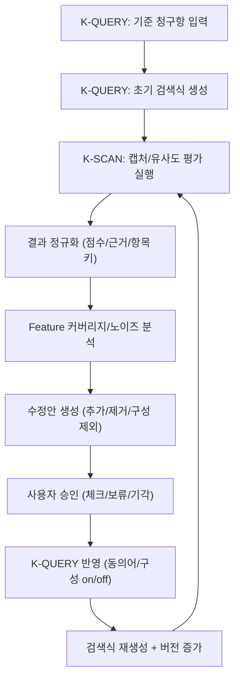
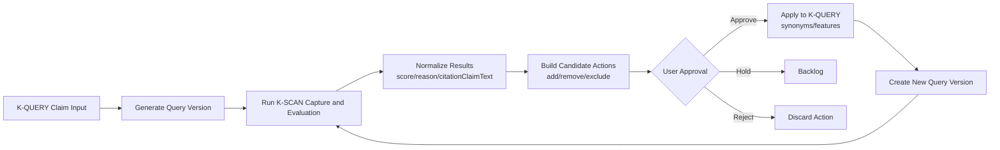
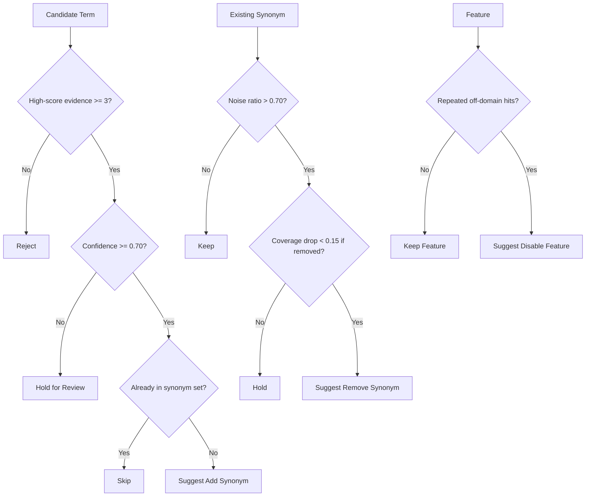
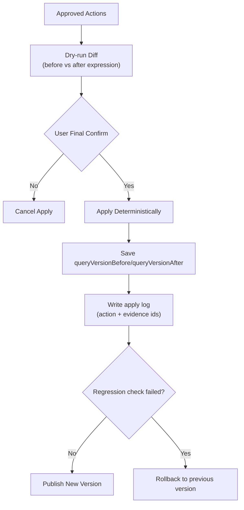

# K-SCAN ↔ K-QUERY 연계 피드백 설계도 (Claim/Similarity 기반)

## 0. 목적

이 문서는 K-SCAN에서 수집한 각 건의 청구항 텍스트와 유사도 결과를 근거로, K-QUERY의 검색식을 반복 개선하는 전체 설계도를 정의한다.
핵심 목표는 다음 3가지다.

1. 유사어 추가: 놓치던 표현을 검색식에 포함
2. 유사어 제거: 노이즈를 유발하는 표현을 검색식에서 제외
3. 검색 방향 조정: 특정 구성(Feature) 자체를 제외하거나 우선순위를 낮춤

---

## 1. 설계 원칙

1. Evidence-first: 모든 수정안은 K-SCAN 결과 항목(출원번호/점수/본문 근거)에 연결되어야 한다.
2. Human-in-the-loop: 자동 제안은 가능하지만 최종 적용은 사용자 승인 단계를 둔다.
3. Deterministic apply: 승인된 수정안은 항상 동일한 방식으로 검색식에 반영된다.
4. Rollback 가능: 검색식 변경 이력과 diff를 저장해 즉시 되돌릴 수 있어야 한다.

---

## 2. End-to-End 루프



---

## 3. 데이터 계약 (무엇을 반드시 그려야 하는가)

## 3.1 K-SCAN 원본 결과 (현재 필드)

현재 `bp_history_v1` 항목은 최소 아래 필드를 가진다.

```json
{
  "id": "1710000000_abcd",
  "time": "2026-03-17 14:10:22",
  "applicationNo": "10-2024-0123456",
  "apiOk": true,
  "apiStatus": 200,
  "payload": "...captured raw...",
  "response": "72 ...reason text..."
}
```

## 3.2 연계용 확장 필드 (추가 권장)

설계도에는 아래 확장 필드를 반드시 포함한다.

```json
{
  "score": 72,
  "responseReason": "유사도 판단 요약",
  "citationClaimText": "인용 건의 핵심 청구항 본문",
  "dwpiSummary": "DWPI 요약",
  "matchedSpans": ["배터리 모듈", "열폭주 차단"],
  "runId": "scan_run_20260317_1410",
  "queryVersionId": "qv_12"
}
```

## 3.3 K-QUERY 아티팩트 연결 키

K-QUERY 쪽에서 아래 구조를 같이 저장하면 후속 분석이 쉬워진다.

```json
{
  "queryVersionId": "qv_12",
  "claimText": "...",
  "elements": [{ "id": "A", "term": "배터리 모듈", "type": "compound" }],
  "synonymsById": {
    "A": [{ "term": "전지 모듈", "match": "token" }]
  },
  "expression": "(배터리+모듈 | 전지+모듈) & (...)"
}
```

---

## 4. 분석 단위 정의 (도메인 모델)

## 4.1 Result Unit

- 키: `resultId` (`history.id`)
- 속성: `applicationNo`, `score`, `citationClaimText`, `responseReason`, `matchedSpans`

## 4.2 Feature Unit

- 키: `featureId` (`elements[].id`)
- 속성: `term`, `synonymSet`, `enabled`

## 4.3 Term Candidate Unit

- 키: `term + featureId`
- 속성: `action(add/remove)`, `confidence`, `evidenceResultIds[]`, `notes`

---

## 5. 의사결정 규칙 (룰북)

## 5.1 유사어 추가 규칙

1. 점수 60 이상 결과에서 동일 후보어가 3건 이상 반복 출현
2. 기존 동의어 집합에 없고 stop-term이 아님
3. `confidence = f(빈도, 평균점수, span정합)`이 임계치 이상

권장 임계치:

- `min_high_score_count = 3`
- `min_confidence = 0.70`

## 5.2 유사어 제거 규칙

1. 특정 유사어가 포함된 결과의 70% 이상이 저품질(점수 < 40)
2. 해당 유사어 제거 시 커버리지 하락이 제한적(핵심 feature hit 유지)

권장 임계치:

- `noise_ratio > 0.70`
- `coverage_drop_if_removed < 0.15`

## 5.3 검색 방향 조정 규칙 (특정 구성 제외)

1. 특정 Feature가 반복적으로 오탐 도메인만 유도
2. 사용자 정책상 해당 구성은 이번 검색 범위에서 제외 가능
3. 제외 전/후 시뮬레이션 diff를 사용자에게 제시

실행 방식:

- Feature 토글(`enabled=false`) 기반 제외를 1순위로 사용
- 완전 제외가 부담되면 우선순위 하향(soft exclude) 모드 제공

---

## 6. UI 설계 (반드시 그릴 화면)

## 6.1 K-SCAN 결과 화면 확장

추가 컬럼/영역:

1. `citationClaimText` 요약 뷰 + 상세 모달
2. 매칭된 K-QUERY Feature 태그 (`A`, `B`, `C`)
3. 후보 액션 칩: `+유사어`, `-유사어`, `구성제외`
4. 우측 패널: "피드백 빌더"

피드백 빌더 액션:

1. 선택 항목 기반 후보 생성
2. 후보별 증거(resultId 목록) 확인
3. 승인/보류/기각 체크
4. "K-QUERY에 반영" 버튼

## 6.2 K-QUERY 반영 화면

필수 컴포넌트:

1. 변경 전/후 검색식 diff
2. Feature별 변경 요약
3. 적용 옵션:
   - 동의어만 반영
   - Feature 제외만 반영
   - 전체 반영
4. 롤백 버튼 (직전 `queryVersionId` 복원)

---

## 7. 프롬프트/스텝 재정의 (GPT-OSS-120b 기준)

## 7.1 K-SCAN 응답 형식 고정

현재 "점수 + 텍스트" 자유형 대신 JSON 고정 출력 권장:

```json
{
  "score": 0,
  "reason": "한 문단 요약",
  "matched_spans": [],
  "candidate_add_terms": [],
  "candidate_remove_terms": [],
  "negative_clues": []
}
```

권장 설정:

- temperature: `0.1~0.2`
- top_p: `0.9`
- max_tokens: 충분히 크게(예: `1200`)

## 7.2 K-QUERY Layer 2 확장 입력

`feedback_instruction`에 아래 형태 주입:

```text
Approved additions:
- A: 전지 팩
- B: 열폭주 차단
Approved removals:
- C: 시스템
Disabled features:
- D
```

## 7.3 판정 스텝 분리

- Step F1: 후보어 추출 (recall 중심)
- Step F2: 후보어 판정 (precision 중심)
- Step F3: 적용안 생성 (deterministic)

---

## 8. 저장/로그/추적성 설계

## 8.1 저장 키 제안

- `kscan_feedback_runs_v1`
- `kquery_query_versions_v1`
- `kquery_feedback_apply_logs_v1`

## 8.2 Apply 로그 스키마

```json
{
  "applyId": "apply_20260317_1430",
  "runId": "scan_run_20260317_1410",
  "queryVersionBefore": "qv_12",
  "queryVersionAfter": "qv_13",
  "actions": [
    {
      "type": "add_synonym",
      "featureId": "A",
      "term": "전지 팩",
      "evidenceResultIds": ["1710000000_abcd"]
    }
  ],
  "approvedByUser": true,
  "ts": "2026-03-17T14:30:00+09:00"
}
```

## 8.3 디버그 필수 항목

1. 후보 생성 근거(어느 result에서 나왔는지)
2. 임계치 계산값(confidence/noise/coverage)
3. 변경 전후 검색식 길이/구성 비교
4. 실패 원인 분류(JSON 파싱 실패, 근거 부족, 정책 차단)

---

## 9. KPI/평가 설계

## 9.1 온라인 지표

1. 고득점 비율: `score >= 60` 항목 비율
2. Feature 커버리지: feature별 최소 1건 매칭 비율
3. 노이즈율: `score < 40` 비율
4. 사용자 승인률: 제안 대비 승인 비율

## 9.2 오프라인 리플레이 지표

1. Precision@20
2. Coverage lift (적용 전후)
3. Query compactness (길이/중복)
4. 롤백 발생률

---

## 10. 단계별 구현 로드맵

## Phase 1: 관측 가능성 확보

1. K-SCAN 히스토리에 `citationClaimText`, `score`, `reason` 구조화 저장
2. runId/queryVersionId 연결
3. 피드백 후보 계산 로그 저장

## Phase 2: 수동 승인형 피드백

1. K-SCAN 피드백 빌더 UI
2. K-QUERY diff/apply UI
3. 동의어 add/remove + feature enable/disable 반영

## Phase 3: 반자동 최적화

1. 신뢰도 높은 후보 자동 pre-check
2. 사용자 1클릭 승인
3. 케이스 누적 기반 규칙 자동 보정

---

## 11. 구현 체크리스트 (설계도에 꼭 들어가야 할 세부 항목)

1. 엔티티 식별자 체계: `runId`, `queryVersionId`, `resultId`, `featureId`
2. 상태 전이: `captured -> normalized -> suggested -> approved -> applied`
3. 승인 지점: 사용자 확인이 필요한 액션 종류
4. 가드레일: 원본 핵심어 삭제 금지, 과도한 제외 금지
5. 롤백: 이전 검색식 즉시 복원 경로
6. 관측성: 입력/출력/근거/결정 로그 연결
7. 재현성: 같은 입력이면 같은 적용안이 나오는지

---

## 12. 권장 초기 파라미터 (시작값)

```json
{
  "score_high": 60,
  "score_low": 40,
  "min_add_evidence_count": 3,
  "min_add_confidence": 0.70,
  "remove_noise_ratio": 0.70,
  "max_auto_actions_per_cycle": 2,
  "require_user_approval_for_exclusion": true
}
```

이 시작값으로 2~3주 운영 후, 승인률/롤백률/고득점비율 변화를 기준으로 보정한다.
## 13. Mermaid Flow Charts

### 13.1 End-to-End Feedback Loop



### 13.2 Candidate Decision Gateway



### 13.3 Apply, Versioning, and Rollback

