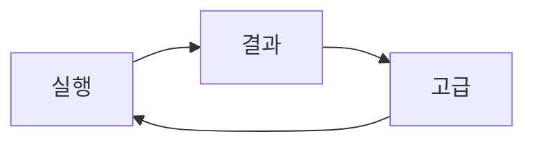

# K-Research (자동 탐색 관제판)

K-Research는 K-SUITE에서 **청구항 기반 검색식 생성 → KOMPASS 수집 → 평가/보정**을 반복하는 자동 탐색 모듈입니다.

이번 UI/UX 개편 기준은 다음입니다.
- 기본 사용 모드: 자동
- 기본 화면 구조: `실행 / 결과 / 고급`
- 수동 버튼은 유지하되, 기본 동선에서는 노출을 낮추고 예외 대응/운영자 도구로 분리

## 빠른 시작 (자동 모드 기준)
1. `실행` 탭에서 청구항 입력(또는 K-QUERY/K-SCAN 가져오기)
2. `초기 검색식 생성`
3. 상단 헤더의 `자동 탐색 시작`
4. Hero 카드에서 현재 단계/최근 Dialog/최근 결과 수/다음 행동 확인
5. 필요 시 `사람 확인 필요` 카드에서 수동 판단(결과 많음/적음/적정)
6. `결과` 탭에서 이번 반복의 점수/커버리지/후보 문헌 확인

## 화면 구조

### 1) 실행
자동 탐색 기본 대시보드입니다.
- 상단 고정 상태바: 자동 상태, 현재 단계, 현재 검색식, 세션/반복
- Hero 상태 카드: 최근 결과 수, 최근 dialog, 마지막 오류, 재시도, 다음 행동
- 청구항 카드: 입력/가져오기/초기 검색식 생성
- 현재 검색식 카드: 요약, 직전 대비 변경, 변경 이유, 세부 상태
- 사람 확인 필요 카드(조건부): 자동 진행 중단 시 수동 판단 버튼 노출

### 2) 결과
이번 반복에서 얻은 결론을 보여줍니다.
- 핵심 지표: 평가 건수, 최고 점수, 커버리지, 종료 판정
- 변경 근거: saturated/gap/noisy/rationale
- 후보: 상위 문헌, 조합 후보

### 3) 고급
운영자용 도구함입니다. 기본 동선에서 내려간 수동 기능이 여기 모여 있습니다.
- 수동 검색/루프 제어: 사이클 시작, 수집 완료+평가 실행, 루프 중단
- 수동 KOMPASS 제어: 검색식 입력, 검색 버튼, 초기 화면 버튼
- 수동 게이트: 결과 많음/적음/적정
- 검색식 원문 편집/저장/복사/롤백
- 평가 진행 현황
- Capture diagnostics
- 피드백/수정 이력

## 자동 상태 해석
- `idle`: 자동 탐색 대기
- `running`: 자동 단계 실행 중
- `stopping`: 현재 단계 종료 후 정지 진행
- `paused`: 수동 확인 필요 상태
- `error`: 오류 상태
- `done`: 종료 조건 충족

## 사람 확인 필요 카드 표시 조건
아래 조건에서만 실행 탭에 강조 노출됩니다.
- 자동 단계가 `paused_manual_required`
- 복구 가능한 자동 오류(결과 수 판독 실패, claim batch 관련 실패, 중복 검색식 재보정 필요 등)
- 수집 중간 판단이 필요한 경우

## 구현 범위 메모
이번 UI 리팩터링은 `modules/k-research/**` 범위에서만 수행되었습니다.
- 변경 중심: `sidepanel.html`, `sidepanel.css`, `sidepanel.js`
- 비중심(루프/판정 엔진): `core/engine.js`, `background-capture.js` 로직 의미는 유지

